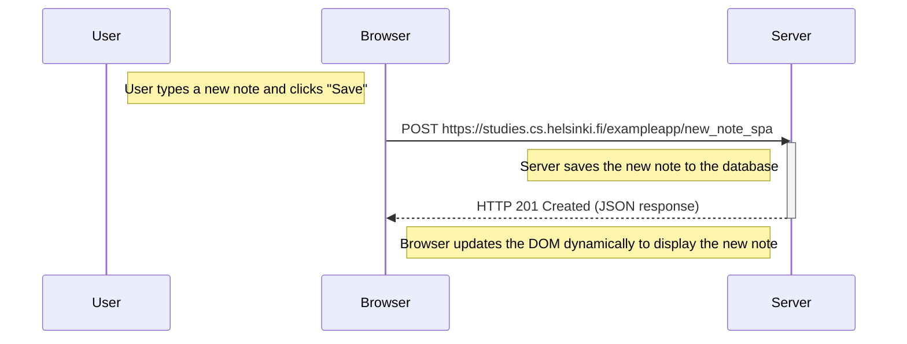

```mermaid
sequenceDiagram
    participant User
    participant Browser
    participant Server

    Note right of User: User types a new note and clicks "Save"

    Browser->>Server: POST https://studies.cs.helsinki.fi/exampleapp/new_note_spa
    activate Server
    Note left of Server: Server saves the new note to the database
    Server-->>Browser: HTTP 201 Created (JSON response)
    deactivate Server

    Note right of Browser: Browser updates the DOM dynamically to display the new note
```
